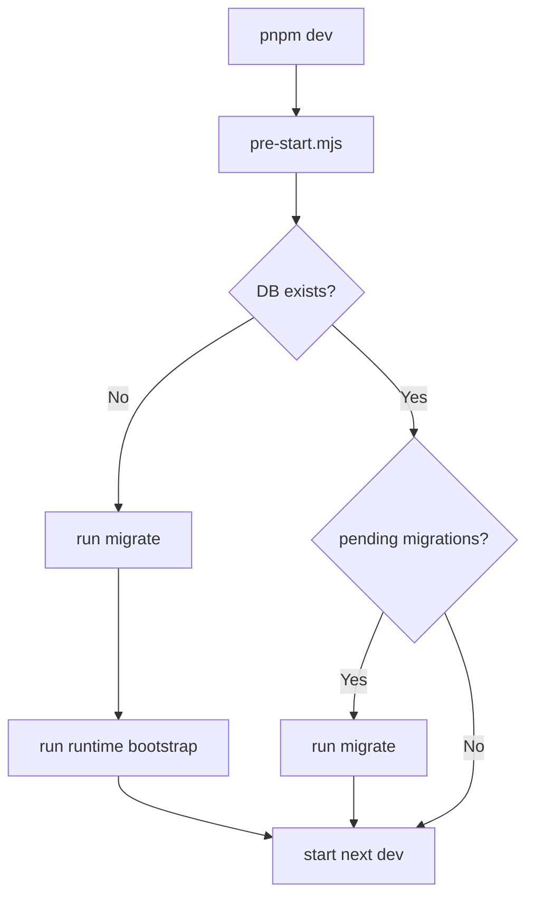

# SahamLens Feature Operability & CLI-WebUI Parity Audit

> **Author:** AI Architecture Audit (2026-06-16)
> **Phase:** V2 Implementation Complete — Pre-Merge Audit
> **Status:** Final

---

## Table of Contents

1. [Current Runtime Architecture](#1-current-runtime-architecture)
2. [Feature Operability Matrix](#2-feature-operability-matrix)
3. [CLI-WebUI Gap Analysis](#3-cli-webui-gap-analysis)
4. [Runtime Dependency Inventory](#4-runtime-dependency-inventory)
5. [First Run Experience Assessment](#5-first-run-experience-assessment)
6. [Autonomous Usage Assessment](#6-autonomous-usage-assessment)
7. [Critical Blockers](#7-critical-blockers)
8. [Sprint Plan: Full CLI-WebUI Integration](#8-sprint-plan-full-cli-webui-integration)
   - Sprint 0: Auto-First-Run Infrastructure
   - Sprint 1: Inline Data Refresh (Every CLI Ops → WebUI Button)
   - Sprint 2: Realtime & Continuous Data
   - Sprint 3: Manageable Operations Dashboard
   - Sprint 4: Hermes WebUI Integration
   - Sprint 5: Polish & Stability

---

## 1. Current Runtime Architecture

```
┌──────────────────────────────────────────────────────────────────┐
│                        USER (Browser)                            │
└──────────────────────────┬───────────────────────────────────────┘
                           │ HTTP :3000
┌──────────────────────────▼───────────────────────────────────────┐
│                    Next.js 15 Server (apps/web/)                  │
│                                                                   │
│  Server Components (11 pages, force-dynamic)                      │
│    └─ lib/*.ts ──→ runPython() ───────────────────┐              │
│                                                     │              │
│  API Routes (6)                                      │              │
│    └─ runPython() ──────────────────────────────────┤              │
│                                                      │              │
│  Server Actions (alerts, earnings)                    │              │
│    └─ lib/*.ts ──→ runPython() ─────────────────────┤              │
└──────────────────────────────────────────────────────┼──────────────┘
                                                       │
┌──────────────────────────────────────────────────────▼──────────────┐
│                    Python Subprocess (execFile)                     │
│                                                                     │
│  scripts/*.py ──→ packages/core/* ──→ DuckDB (data/private/)       │
│                                                                     │
│  One-shot read/write per HTTP request. No connection pool.          │
│  No long-running process (except Hermes, optional).                 │
└────────────────────────────────────────────────────────────────────┘

┌───────────────────────────────────────────────────────────────────┐
│  Optional: Hermes Runtime (services/hermes/)                      │
│  Long-polling Telegram listener. Manual start only.               │
│  AI research via Telegram. NOT needed for WebUI.                  │
└───────────────────────────────────────────────────────────────────┘
```

### Characteristik Arsitektur

- WebUI tidak pernah akses DuckDB langsung — selalu via Python subprocess (`runPython`)
- Semua pages `force-dynamic` (no SSG/ISR), setiap render jalankan Python
- Tidak ada BFF layer — Next.js IS the BFF
- Tidak ada connection pool — setiap request spawn Python subprocess baru
- Tidak ada caching layer — setiap request fresh dari DuckDB
- Hermes adalah proses independen — tidak ada shared state dengan WebUI

---

## 2. Feature Operability Matrix

| Feature | Akses | Fungsi | Persist | Otomatis | Catatan |
|---|---|---|---|---|---|
| **Dashboard** `/` | ✅ | ✅ | N/A | ✅ | Static nav grid. Tidak ada dependency data. |
| **Data Quality** `/data-quality` | ✅ | ✅ | ✅ | ❌ Manual | Harus `provider_health refresh` di CLI. WebUI read-only. |
| **Screener** `/screener` | ✅ | ✅ | ✅ | ❌ Manual | Data dari DB. Harus `screener run` setiap kali. |
| **Weekly Review** `/journal/weekly-review` | ✅ | ✅ | ✅ | ❌ Manual | Harus `journal_review review generate` tiap minggu. |
| **Strategy Rules** `/strategy-rules` | ✅ | ✅ | ✅ | ❌ Manual | Harus `journal_review rules evaluate` manual. |
| **Alerts** `/alerts` | ✅ | ✅ | ✅ | ❌ Manual | Evaluasi hanya via CLI `alerts evaluate`. Tidak ada scheduler. |
| **Earnings** `/earnings` | ✅ | ✅ | ✅ | ❌ Manual | Input manual. Tidak ada auto-fetch. |
| **Watchlist** `/watchlist` | ✅ | ✅ | ✅ | ❌ Manual | CRUD via WebUI. Seed hanya CLI. |
| **Trade Journal** `/journal` | ✅ | ✅ | ✅ | ✅ WebUI | Full CRUD dari WebUI via API routes. |
| **Portfolio** `/portfolio` | ✅ | ✅ | ✅ | ✅ WebUI | Full CRUD + CSV import via WebUI. |
| **Stock Detail** `/stocks/[symbol]` | ✅ | ✅ | N/A | ❌ Manual | Data dari `ingest_prices`, `fundamentals`, `ingest_news` — semua CLI. |
| **AI Brief** `/stocks/[symbol]#brief` | ✅ | ✅ | ✅ ai_log | ✅ WebUI | Trigger dari WebUI. Data pre-existing. |
| **AI Chat** `/stocks/[symbol]#chat` | ✅ | ✅ | ✅ ai_log | ✅ WebUI | Trigger dari WebUI. |
| **News Summary** `/stocks/[symbol]#news` | ✅ | ✅ | ✅ news | ❌ Manual | Ingest + summarize hanya dari CLI. |
| **Hermes Runtime** (Telegram) | ⛔ | N/A | N/A | ❌ Manual | Butuh `uv run python -m services.hermes` + config Telegram. |

- ✅ = Works / ❌ = Tidak auto-run / ⛔ = Tidak accessible

### Read vs Write Operability

| Feature | Read (WebUI) | Write/Refresh (WebUI) | Write/Refresh (CLI Only) |
|---|---|---|---|
| **Data Quality** | ✅ | ❌ | `provider_health refresh` |
| **Prices** | ✅ | ❌ | `ingest_prices --symbols X --days 365` |
| **Fundamentals** | ✅ | ❌ | `fundamentals coverage refresh --symbols X` |
| **Indicators** | ✅ | ❌ | `calculate_indicators --symbols X` |
| **News** | ✅ | ❌ | `ingest_news` + `summarize_news` |
| **Screener** | ✅ | ❌ | `screener run` |
| **Weekly Review** | ✅ | ❌ | `journal_review review generate` |
| **Strategy Rules Eval** | ✅ | ❌ | `journal_review rules evaluate` |
| **Alerts Evaluate** | ✅ | ❌ | `alerts evaluate` |

**Kesimpulan: WebUI adalah view-only untuk data operasional. Semua write/refresh ada di CLI.**

---

## 3. CLI-WebUI Gap Analysis

### 3a. Operasi Hanya di CLI (Belum di WebUI)

| Operasi | Script | File | Dampak User | Prioritas |
|---|---|---|---|---|
| **Ingest Prices** | `ingest_prices --symbols X --days 365` | `scripts/ingest_prices.py` | Stock detail "No local price data" | **P0** |
| **Refresh Provider Health** | `provider_health refresh` | `scripts/provider_health.py` | Data Quality kosong | **P0** |
| **Ingest Fundamentals** | `fundamentals coverage refresh` | `scripts/fundamentals.py` | Stock detail "No fundamental snapshot" | **P0** |
| **Calculate Indicators** | `calculate_indicators --symbols X` | `scripts/calculate_indicators.py` | Stock detail indikator kosong | **P0** |
| **Ingest News** | `ingest_news` | `scripts/ingest_news.py` | "No summarized news yet" | **P1** |
| **Summarize News** | `summarize_news` | `scripts/summarize_news.py` | News items raw, belum di-summarize | **P1** |
| **Run Screener** | `screener run` | `scripts/screener.py` | Screener results stale | **P1** |
| **Generate Weekly Review** | `journal_review review generate` | `scripts/journal_review.py` | Review tidak auto-generate | **P1** |
| **Evaluate Alerts** | `alerts evaluate` | `scripts/alerts.py` | Alerts tidak pernah dievaluasi | **P1** |
| **Evaluate Strategy Rules** | `journal_review rules evaluate` | `scripts/journal_review.py` | Rule violations tidak di-check | **P1** |
| **Bootstrap** | `runtime bootstrap` | `scripts/runtime.py` | Full init sequence | **P0** |
| **Migration** | `migrate` | `scripts/migrate.py` | DB schema stale | **P0** |

### 3b. Operasi yang SUDAH Terkoneksi WebUI ✅

| Operasi | WebUI Path | Method | Data Flow |
|---|---|---|---|
| **Watchlist CRUD** | `/watchlist` | Server Component → `runPython` | ✅ Full cycle |
| **Trade Plan CRUD** | `/journal` + `/journal/new` | API Route → `runPython` | ✅ Full cycle |
| **Portfolio CRUD** | `/portfolio` + `/portfolio/import` | API Route → `runPython` | ✅ Full cycle |
| **Alert Rules CRUD** | `/alerts` | Server Action → `runPython` | ✅ Full cycle |
| **Earnings Events CRUD** | `/earnings` | Server Action → `runPython` | ✅ Full cycle |
| **AI Brief** | `/stocks/[symbol]#brief` | API Route → `runPython` | ✅ Full cycle |
| **AI Chat** | `/stocks/[symbol]#chat` | API Route → `runPython` | ✅ Full cycle |
| **AI Critique** | `/journal` | API Route → `runPython` | ✅ Full cycle |

### 3c. Gap: Data Refresh Lifecycle

```
Current State:
  WebUI Read ──→ DuckDB ──→ (data stale forever without CLI)
                    ↑
  CLI Write ────────┘ (manual, developer-level)

Target State:
  WebUI Read ──→ DuckDB ←── WebUI Refresh Button (every user)
                    ↑
  Scheduler ────────┘ (automatic, continuous)
```

---

## 4. Runtime Dependency Inventory

### 4a. Proses Wajib (Required untuk WebUI)

| Proses | Start Command | Auto-Start? | Health Check? | Gagal → |
|---|---|---|---|---|
| Next.js dev server | `pnpm dev` | ❌ Manual | N/A | WebUI down |
| DuckDB file | N/A (file access) | N/A | N/A | Semua fitur gagal |
| Python subprocess | Spawned by Next.js | ✅ Auto via `runPython()` | N/A | `RuntimeErrorState` |

### 4b. Proses Opsional

| Proses | Start Command | Auto-Start? | Health Check? | Gagal → |
|---|---|---|---|---|
| Hermes (Telegram) | `uv run python -m services.hermes` | ❌ Manual | ❌ None | Telegram unresponsive. WebUI OK. |

### 4c. Hidden Dependencies

| Dependency | Lokasi | Jika Missing | Severity |
|---|---|---|---|
| `.env.local` | Root | LLM fallback ke Anthropic (key missing → AI silent fail) | **P1** |
| `config/cost_budget.yml` | `config/` | Fallback ke `.example` — OK | **P2** |
| `PYTHON_BIN` env var | Env/auto | `python not found` — semua page error | **P0** |
| LLM provider env vars | `.env.local` | AI features silent return None | **P1** |

---

## 5. First Run Experience Assessment

### Current User Journey

```
Step 1: git clone
Step 2: cp .env.example .env.local           ← harus manual
Step 3: uv sync                               ← Python deps
Step 4: pnpm install                          ← JS deps
Step 5: uv run python -m scripts.migrate      ← manual CLI ← BLOKER
Step 6: pnpm dev                              ← web app starts
  → /dashboard: ✅ OK
  → /data-quality: 🔴 RuntimeErrorState — suruh migrate
  → /watchlist: 🔴 RuntimeErrorState — suruh migrate
  → /stocks/BBCA: 🔴 RuntimeErrorState — suruh migrate
```

### Post-Migration: Masih Harus 8+ CLI Commands

```bash
# Minimum viable data (semua manual CLI):
uv run python -m scripts.watchlist seed                               # 1
uv run python -m scripts.provider_health refresh                       # 2
uv run python -m scripts.ingest_prices --symbols BBCA.JK --days 365    # 3
uv run python -m scripts.calculate_indicators --symbols BBCA.JK        # 4
uv run python -m scripts.fundamentals coverage refresh                 # 5
uv run python -m scripts.ingest_news                                   # 6
uv run python -m scripts.summarize_news                                # 7
uv run python -m scripts.screener run                                  # 8
```

### Blockers

| # | Blocker | Severity | Detail |
|---|---|---|---|
| B1 | No auto-migration on `pnpm dev` | **P0** | User harus manual `migrate` sebelum bisa pakai fitur apa pun |
| B2 | No auto-bootstrap after migration | **P0** | 31 tabel kosong. Data kosong. User harus 8+ CLI commands |
| B3 | No "Refresh" buttons in WebUI | **P0** | Tidak ada tombol untuk trigger data refresh dari UI |
| B4 | No Python auto-detect | **P0** | `PYTHON_BIN` tidak di-set → semua page error |
| B5 | LLM provider not configured = silent fail | **P1** | AI brief/chat return None tanpa pesan jelas |
| B6 | Data always stale, no refresh | **P1** | Tidak ada mekanisme auto-refresh data |
| B7 | CLI commands in error states | **P1** | Error states menyuruh user buka terminal |

---

## 6. Autonomous Usage Assessment

### Simulasi 30 Hari

| Hari | Peristiwa | Status |
|---|---|---|
| 1 | Clone + migrate + bootstrap | ✅ Aplikasi usable |
| 3 | Prices 2 hari stale | ❌ Harus CLI refresh |
| 7 | News 6 hari stale | ❌ Harus CLI re-ingest |
| 7 | Weekly review due | ❌ Tidak ada prompt/reminder |
| 14 | Screener results 13 hari stale | ❌ Tidak auto-update |
| 30 | Semua data stale. Aplikasi read-only. | ❌ Perlu 5+ CLI |

### Autonomous Runtime Checklist

| Kemampuan | Status | Target |
|---|---|---|
| Application startup lifecycle | ❌ None | **Sprint 0** |
| Service registration | ❌ None | **Sprint 4** |
| Health monitoring | ❌ None | **Sprint 3** |
| Dependency validation | ❌ None | **Sprint 0** |
| Auto-migration | ❌ Manual | **Sprint 0** |
| Auto-bootstrap | ❌ Manual | **Sprint 0** |
| Auto-refresh (scheduler) | ❌ None | **Sprint 2** |
| Staleness detection | ❌ None | **Sprint 2** |
| Config UI | ❌ None | **Sprint 3** |

---

## 7. Critical Blockers

Ranked by user impact:

| Rank | Blocker | Dampak User |
|---|---|---|---|
| **P0** | Tidak ada auto-migration saat startup | 11/13 halaman error. User ga bisa pakai aplikasi. |
| **P0** | Tidak ada auto-bootstrap saat first-run | Semua data kosong. User harus 8+ CLI commands. |
| **P0** | Tidak ada refresh button di WebUI | Semua data write/refresh hanya CLI. WebUI view-only. |
| **P0** | Python binary auto-detect tidak ada | Semua page error kalo Python tidak terdeteksi. |
| **P1** | LLM provider silent failure | AI features return None tanpa notifikasi user. |
| **P1** | Tidak ada scheduled refresh | Data auto-stale setelah N hari. |
| **P1** | Tidak ada staleness indicator | User tidak tau kalo data sudah basi. |

---

## 8. Sprint Plan: Full CLI-WebUI Integration

### Strategy

```
Sprint 0: Auto-First-Run
  Auto migration + bootstrap + Python detect.
  → User bisa clone, pnpm dev, langsung punya app usable.

Sprint 1: Inline Data Refresh
  Setiap operasi CLI → tombol WebUI.
  → User bisa refresh data tanpa buka terminal.

Sprint 2: Realtime & Continuous
  Scheduler auto-refresh + staleness detection.
  → Data selalu up-to-date tanpa intervensi.

Sprint 3: Manageable Operations
  Status dashboard + config UI + health monitoring.
  → User bisa monitor & manage dari WebUI.

Sprint 4: Hermes Integration
  Hermes status + control dari WebUI.
  → Telegram runtime bisa start/stop/monitor dari UI.

Sprint 5: Polish & Stability
  Error boundaries, loading states, edge cases.
  → Production-grade UX.

Total timeline: ~6-8 weeks (single developer)
```

---

### Sprint 0: Auto-First-Run Infrastructure

> **Goal:** User bisa `git clone && pnpm dev` langsung dapat aplikasi usable.
> **Duration:** 3-4 hari
> **Files touched:** `scripts/`, `apps/web/package.json`, `apps/web/lib/`

#### Task 0.1 — Pre-Start Hook (Auto Migration + Bootstrap)

Buat `apps/web/scripts/pre-start.mjs` yang jalan SEBELUM `next dev`:



**Files:**
- `apps/web/scripts/pre-start.mjs` — new file
- `apps/web/package.json` — add `"dev": "node scripts/pre-start.mjs && next dev"`

**Detail `pre-start.mjs`:**
```js
// pseudo-code
const result = execSync("uv run python -m scripts.migrate", { cwd: repoRoot });
if (result.exitCode !== 0) {
  console.error("Migration failed:", result.stderr);
  process.exit(1);
}
const bootstrap = execSync("uv run python -m scripts.runtime bootstrap --json", { cwd: repoRoot });
// check if bootstrap actually ran, log summary
```

**Acceptance Criteria:**
- [ ] `pnpm dev` pertama kali auto-create DuckDB + apply semua migrations
- [ ] Jika DB sudah ada tapi pending migrations, auto-apply sebelum start
- [ ] Jika migration gagal, dev server tidak start
- [ ] Log migration status ke console

#### Task 0.2 — Python Binary Auto-Detect

Update `apps/web/src/lib/pythonRunner.ts` untuk auto-detect Python:

```ts
// logic:
// 1. Check PYTHON_BIN env var
// 2. If not set: try "python", "python3", "uv run python"
// 3. Use first that works
// 4. Cache result for session
```

**Acceptance Criteria:**
- [ ] Auto-detect Python tanpa `PYTHON_BIN` env var
- [ ] Cache hasil deteksi per session
- [ ] Jika tidak ada Python, tampilkan error jelas dengan panduan install

#### Task 0.3 — Dependency Validation on Startup

Update `pre-start.mjs` untuk validasi dependencies sebelum start:

```bash
1. Check Python exists
2. Check DuckDB file writable
3. Check .env.local exists
4. Check config/*.yml exists (or use .example fallback)
5. Report all issues before starting dev server
```

**Acceptance Criteria:**
- [ ] Validasi Python binary ada
- [ ] Validasi `.env.local` ada (warning jika tidak)
- [ ] Validasi direktori `data/private/` writable
- [ ] Output ke console dengan warna: ✅/❌ per dependency

#### Task 0.4 — First-Run Init Banner

Update root layout atau dashboard page untuk first-run detection:

```tsx
// Jika runtime status pertama kali: tampilkan welcome banner
// "Selamat datang di SahamLens! Data sudah siap. Tambahkan watchlist untuk mulai."
```

**Acceptance Criteria:**
- [ ] Dashboard detect first-run state
- [ ] Tampilkan welcome banner (bisa di-dismiss)
- [ ] CTA untuk add watchlist / import portfolio

---

### Sprint 1: Inline Data Refresh

> **Goal:** Setiap operasi CLI → tombol WebUI. User tidak perlu terminal.
> **Duration:** 5-7 hari
> **Files touched:** `apps/web/src/lib/*.ts`, `apps/web/src/app/*/page.tsx`

#### Task 1.1 — Refresh Price Data Button (Stock Detail)

**WebUI Path:** `/stocks/[symbol]`

Tambahkan tombol "Refresh Prices" di Stock Detail page. Saat diklik:

1. Panggil `scripts.ingest_prices --symbols X --days 365` via API route
2. Loading state selama proses (progress bar optional)
3. Setelah selesai, refresh halaman dengan data baru
4. Show success/error toast

**Files:**
- `apps/web/src/app/api/stocks/[symbol]/refresh-prices/route.ts` — new API route
- `apps/web/src/lib/stockDetail.ts` — new function `refreshPrices(symbol)`
- `apps/web/src/app/stocks/[symbol]/page.tsx` / client component — add button

**Detail API Route:**
```ts
// POST /api/stocks/[symbol]/refresh-prices
// Calls: scripts.ingest_prices --symbols [symbol] --days 365
// Timeout: 120s (yfinance bisa lambat)
// Response: { ok: true, days_inserted: 365 }
```

**Plus auto-calculate indicators after price ingest:**
```ts
// After prices ingested, auto-call calculate_indicators
// Calls: scripts.calculate_indicators --symbols [symbol]
// No separate button needed for indicators
```

**Acceptance Criteria:**
- [ ] Tombol "Refresh Prices" visible di Stock Detail page
- [ ] Loading state (spinner + "Fetching price data from yfinance...")
- [ ] Auto-calculate indicators setelah prices selesai
- [ ] Error handling (network error, yfinance down, symbol not found)
- [ ] Notifikasi sukses/gagal
- [ ] Page reload otomatis setelah selesai

#### Task 1.2 — Refresh Fundamentals Button (Stock Detail)

**WebUI Path:** `/stocks/[symbol]`

Tambahkan tombol "Refresh Fundamentals" di sebelah Fundamental card.

**Files:**
- `apps/web/src/app/api/stocks/[symbol]/refresh-fundamentals/route.ts` — new API route
- `apps/web/src/lib/fundamentals.ts` — new function `refreshFundamentals(symbol)`
- Stock Detail page — add button (client component)

**Acceptance Criteria:**
- [ ] Tombol "Refresh Fundamentals" visible
- [ ] Loading state
- [ ] Error handling
- [ ] Auto-refresh page setelah selesai

#### Task 1.3 — Refresh Provider Health Button (Data Quality)

**WebUI Path:** `/data-quality`

Ubah `RuntimeErrorState` menjadi tombol "Check Provider Health Now".

**Files:**
- `apps/web/src/app/api/data-quality/refresh/route.ts` — new API route
- `apps/web/src/lib/dataQuality.ts` — new function `refreshProviderHealth()`
- Data Quality page — replace error state with refresh button

**Acceptance Criteria:**
- [ ] Tombol "Check Provider Health" menggantikan error state
- [ ] Loading state selama refresh
- [ ] Setelah selesai, tampilkan hasil provider health
- [ ] Error jika yfinance tidak respond

#### Task 1.4 — Fetch News Button (Stock Detail)

**WebUI Path:** `/stocks/[symbol]`

Tambahkan tombol "Fetch & Summarize News" di News section.

**Files:**
- `apps/web/src/app/api/stocks/[symbol]/fetch-news/route.ts` — new API route
- Stock Detail page — add button

**Chaining:**
```ts
// 1. Ingest news: scripts.ingest_news (all feeds)
// 2. Summarize news: scripts.summarize_news (pending articles)
// Jalankan berurutan. Total timeout: 180s.
```

**Acceptance Criteria:**
- [ ] Tombol "Fetch & Summarize News" visible
- [ ] Loading state "Fetching news feeds..." → "Summarizing articles..."
- [ ] Error handling per step
- [ ] Tidak blocking UI lain

#### Task 1.5 — Run Screener Button (Screener)

**WebUI Path:** `/screener`

Tambahkan tombol "Run Screener Now".

**Files:**
- `apps/web/src/app/api/screener/run/route.ts` — new API route
- `apps/web/src/lib/screener.ts` — new function `runScreener()`
- Screener page — add button

**Acceptance Criteria:**
- [ ] Tombol "Run Screener Now" visible
- [ ] Loading + progress
- [ ] Menampilkan hasil baru setelah selesai
- [ ] Error handling

#### Task 1.6 — Generate Weekly Review Button

**WebUI Path:** `/journal/weekly-review`

Tambahkan tombol "Generate Weekly Review".

**Files:**
- `apps/web/src/app/api/journal/generate-review/route.ts` — new API route
- `apps/web/src/lib/journalReview.ts` — new function `generateWeeklyReview()`

**Acceptance Criteria:**
- [ ] Tombol "Generate Weekly Review" visible
- [ ] Loading + "Generating review from journal entries..." (60s timeout)
- [ ] Hasil review langsung tampil
- [ ] Handle empty journal (tampilkan pesan)

#### Task 1.7 — Evaluate Alerts Button (Alerts)

**WebUI Path:** `/alerts`

Tambahkan tombol "Evaluate Alerts Now".

**Files:**
- `apps/web/src/app/api/alerts/evaluate/route.ts` — new API route
- `apps/web/src/lib/alerts.ts` — new function `evaluateAlerts()`

**Acceptance Criteria:**
- [ ] Tombol visible di halaman alerts
- [ ] Loading + hasil evaluasi
- [ ] Error handling
- [ ] Auto-refresh events list

#### Task 1.8 — Evaluate Strategy Rules Button

**WebUI Path:** `/strategy-rules`

Tambahkan tombol "Evaluate Rules Now".

**Files:**
- `apps/web/src/app/api/strategy-rules/evaluate/route.ts` — new API route
- `apps/web/src/lib/strategyRules.ts` — new function `evaluateRules()`

**Acceptance Criteria:**
- [ ] Tombol visible
- [ ] Loading + hasil
- [ ] Error handling

#### Task 1.9 — Unified Loading/Toast System

Buat komponen reusable untuk feedback operasi async:

```tsx
<OperationButton
  label="Refresh Prices"
  runningLabel="Fetching price data..."
  onRun={() => refreshPrices(symbol)}
  onComplete={() => revalidatePage()}
  variant="secondary"
  timeout={120_000}
/>
```

**Files:**
- `apps/web/src/components/ui/OperationButton.tsx` — new component
- Pakai di semua task Sprint 1

**Acceptance Criteria:**
- [ ] Loading spinner
- [ ] Disabled state selama running
- [ ] Timeout handling
- [ ] Success/error toast
- [ ] Revalidate page on complete (opsional)

---

### Sprint 2: Realtime & Continuous Data

> **Goal:** Data selalu up-to-date. User tidak perlu klik refresh manual.
> **Duration:** 5-7 hari
> **Files touched:** `packages/core/runtime/`, `scripts/`, `apps/web/lib/`

#### Task 2.1 — Simple Scheduler Service

Buat scheduler minimal (apscheduler atau pure asyncio) yang jalan sebagai background thread di `scripts/scheduler.py`.

**Fitur:**
```yaml
refresh_intervals:
  provider_health: 3600        # every 1 hour
  ingest_prices: 86400         # every 24 hours (after market close)
  calculate_indicators: 86400  # after prices
  ingest_news: 3600            # every 1 hour
  summarize_news: 3600         # every 1 hour
  evaluate_alerts: 300         # every 5 minutes
  evaluate_strategy_rules: 3600  # every 1 hour
  run_screener: 86400          # every 24 hours
  generate_weekly_review: 604800  # every 7 days
```

**Files:**
- `scripts/scheduler.py` — new file
- `packages/core/runtime/scheduler.py` — core logic

**Architecture:**
```
scripts/scheduler.py
  └─ packages/core/runtime/scheduler.py
       ├─ SchedulerConfig (loaded from env/config)
       ├─ SchedulerEngine (asyncio loop)
       │   ├─ register_task(name, interval, callback, timeout)
       │   └─ start() / stop()
       ├─ Built-in tasks:
       │   ├─ refresh_provider_health()
       │   ├─ ingest_prices()
       │   ├─ calculate_indicators()
       │   ├─ ingest_news()
       │   ├─ summarize_news()
       │   ├─ evaluate_alerts()
       │   ├─ evaluate_strategy_rules()
       │   ├─ run_screener()
       │   └─ generate_weekly_review()
       └─ Logging ke ai_log + file log
```

**Integration:**
```bash
# Option A: Run alongside web app
pnpm dev + scheduler (background)
# Option B: Standalone process
uv run python -m scripts.scheduler
# Option C: Future — embed in Hermes or web process
```

**Acceptance Criteria:**
- [ ] Scheduler bisa start/stop graceful
- [ ] Tiap task punya interval sendiri
- [ ] Task tidak blocking satu sama lain
- [ ] Error handling per task (task gagal tidak mematikan scheduler)
- [ ] Logging task execution
- [ ] Configurable via env vars atau config file

#### Task 2.2 — Data Freshness Tracker

Buat sistem tracking kapan terakhir data di-refresh.

**Files:**
- `packages/core/runtime/freshness.py` — new module

**Konsep:**
```python
# Track per data type last refresh timestamp
@dataclass
class FreshnessRecord:
    data_type: str          # "prices", "news", "fundamentals", etc.
    symbol: str | None
    last_refreshed_at: datetime
    status: str             # "fresh", "stale", "unknown"

# Store in DuckDB or JSON file
# Query: last_refreshed_at + freshness_threshold = stale?
```

**Acceptance Criteria:**
- [ ] Record last refresh time per data type
- [ ] Query freshness status (fresh/stale/unknown)
- [ ] Threshold configurable per data type

#### Task 2.3 — Data Staleness Indicators in WebUI

Update setiap page untuk tampilkan data freshness.

```tsx
// DataQuality page:
<FreshnessBadge dataType="provider_health" />  // "Fresh" / "Stale (2h ago)"

// Stock Detail:
<FreshnessBadge dataType="prices" symbol="BBCA.JK" />
```

**Files:**
- `apps/web/src/components/ui/FreshnessBadge.tsx` — new component
- `apps/web/src/lib/runtime.ts` — + `checkFreshness(dataType, symbol?)`
- Update pages: Data Quality, Stock Detail, Screener, Alerts

**Acceptance Criteria:**
- [ ] Badge "Fresh"/"Stale" visible di tiap page
- [ ] Stale badge kasih tahu kapan terakhir refresh
- [ ] Klik stale badge → trigger refresh

#### Task 2.4 — Stale Data Global Banner

Update root layout untuk tampilkan notification bar jika ada data stale.

```tsx
// apps/web/src/app/layout.tsx
<StaleDataBanner />
// Mengecek data freshness secara periodik
// "Beberapa data sudah stale. Klik untuk refresh."
```

**Files:**
- `apps/web/src/components/ui/StaleDataBanner.tsx` — new component
- Update layout

**Acceptance Criteria:**
- [ ] Banner muncul jika ada data stale
- [ ] Banner bisa di-dismiss
- [ ] Click → refresh semua data stale
- [ ] Hanya muncul di halaman yang relevan

#### Task 2.5 — Auto-Refresh on Page Load

Update pages untuk auto-refresh data stale saat di-load (configurable).

```tsx
// Di setiap page (opsional):
useEffect(() => {
  if (freshness === "stale" && !isRefreshing) {
    refreshData();
  }
}, [freshness]);
```

**Acceptance Criteria:**
- [ ] Page auto-refresh data stale (dengan konfirmasi atau silent)
- [ ] Tidak infinite loop
- [ ] Configurable via env var (AUTO_REFRESH_ON_LOAD=true/false)

---

### Sprint 3: Manageable Operations Dashboard

> **Goal:** User bisa monitor & manage semua operasi dari WebUI.
> **Duration:** 4-5 hari
> **Files touched:** `apps/web/src/app/admin/`, `apps/web/lib/`

#### Task 3.1 — Operations Status Dashboard

Buat halaman `/admin/operations` yang menampilkan:

```tsx
// Tabel semua operasi:
// ┌────────────────────┬────────────┬──────────┬──────────────┐
// │ Operation          │ Last Run   │ Status   │ Action       │
// ├────────────────────┼────────────┼──────────┼──────────────┤
// │ Ingest Prices      │ 2h ago     │ ✅ OK    │ [Run Now]    │
// │ Refresh Provider   │ 5h ago     │ ⚠️ Stale │ [Run Now]    │
// │ Evaluate Alerts    │ 10m ago    │ ✅ OK    │ [Run Now]    │
// │ ...                │ ...        │ ...      │ ...          │
// └────────────────────┴────────────┴──────────┴──────────────┘
```

**Files:**
- `apps/web/src/app/admin/operations/page.tsx` — new page
- `apps/web/src/app/admin/layout.tsx` — admin layout
- `apps/web/src/lib/operations.ts` — new lib module

**Features:**
- List semua operasi dengan status terakhir
- Tombol "Run Now" untuk setiap operasi
- Scheduler status (running/stopped) + toggle
- Log history per operasi

**Acceptance Criteria:**
- [ ] Halaman accessible via `/admin/operations`
- [ ] Semua operasi visible dengan status
- [ ] "Run Now" button works
- [ ] Scheduler status indicator
- [ ] Log history untuk operasi terakhir

#### Task 3.2 — Scheduler Management UI

Di halaman admin, tambahkan kontrol scheduler:

```tsx
<SchedulerPanel>
  ┌────────────────────────────────────────────┐
  │ Scheduler: 🟢 Running                      │
  │ Interval: 5m auto-check                    │
  │ [Stop Scheduler] [Configure Intervals]     │
  │                                            │
  │ Next scheduled runs:                       │
  │ ├─ Alerts Evaluation        in 2m          │
  │ ├─ News Ingest              in 18m         │
  │ └─ Price Refresh            in 6h          │
  └────────────────────────────────────────────┘
```

**Files:**
- `apps/web/src/app/admin/operations/page.tsx` — extend
- API routes untuk scheduler control

**Acceptance Criteria:**
- [ ] Start/stop scheduler
- [ ] Lihat next scheduled run
- [ ] Konfigurasi interval per task

#### Task 3.3 — Configuration UI

Buat halaman `/admin/config` untuk config dari WebUI:

```yaml
# Config yang bisa di-edit dari UI:
- LLM Provider: dropdown (anthropic / openai-compatible / tokenrouter)
- LLM API Key: (password field)
- LLM Base URL: text field
- LLM Model: text field
- Watchlist: add/remove symbols from list
- RSS Feeds: add/edit/remove news sources
- Indicator Parameters: edit MA periods, RSI, MACD
- Scheduler Intervals: per-task interval in seconds
```

**Files:**
- `apps/web/src/app/admin/config/page.tsx` — new page
- API route untuk read/write config
- Config disimpan ke `config/*.yml` atau DB

**Acceptance Criteria:**
- [ ] Tersimpan ke file atau DB
- [ ] Read config (tampilkan current values)
- [ ] Write config (update + persist)
- [ ] Validasi input
- [ ] Tidak menyimpan secrets di commit (gitignored)

#### Task 3.4 — Health Check Endpoint

Buat endpoint `/api/health` untuk monitoring:

```json
{
  "status": "ok",
  "python": { "version": "3.12.7", "path": "C:\\Python312\\python.exe" },
  "duckdb": { "path": "data/private/sahamlens.duckdb", "size_mb": 4.2, "tables": 31 },
  "scheduler": { "running": true, "tasks": 8, "uptime_h": 2.5 },
  "hermes": { "running": false, "last_seen": null },
  "llm": { "provider": "tokenrouter", "model": "MiniMax-M3", "configured": true }
}
```

**Files:**
- `apps/web/src/app/api/health/route.ts` — new API route
- Dipanggil oleh WebUI admin + bisa untuk uptime monitoring

**Acceptance Criteria:**
- [ ] Endpoint `/api/health` returns JSON
- [ ] Covers all major components
- [ ] Fast response (<1s)
- [ ] No sensitive info leaked

---

### Sprint 4: Hermes WebUI Integration

> **Goal:** Hermes runtime bisa di-monitor dan di-control dari WebUI.
> **Duration:** 3-4 hari
> **Files touched:** `services/hermes/`, `apps/web/src/app/admin/`

#### Task 4.1 — Hermes Status Check

Buat mekanisme untuk cek apakah Hermes sedang running:

```python
# services/hermes/health.py — new file
def is_hermes_running() -> bool:
    """Check if Hermes process is alive via PID file or heartbeat."""
    # Option A: PID file di data/private/hermes.pid
    # Option B: Hermes tulis heartbeat ke DuckDB tiap N detik
    # Option C: Health check endpoint (tapi Hermes ga punya HTTP server...)
```

**Pendekatan: Simple DuckDB heartbeat:**
```python
# Di hermes/telegram_listener.py, tiap polling loop:
# 1. Update hermes_heartbeat table: last_seen = now, status = "running"
# 2. Di WebUI: query hermes_heartbeat for status
```

**Acceptance Criteria:**
- [ ] Hermes write heartbeat ke DB tiap 30 detik
- [ ] WebUI bisa baca status Hermes dari DB
- [ ] Jika heartbeat >60s: status "stopped"
- [ ] Hermes update status "stopped" saat graceful shutdown

#### Task 4.2 — Hermes Control Panel (Admin)

Tambahkan Hermes panel di `/admin/operations`:

```tsx
<HermesPanel>
  ┌────────────────────────────────────────────┐
  │ Telegram Hermes: 🔴 Stopped                │
  │                                            │
  │ Telegram: not configured                    │
  │ LLM: tokenrouter / MiniMax-M3 ✅           │
  │                                            │
  │ [Start Hermes]  [View Logs]                │
  │                                            │
  │ Quick start:                                │
  │ uv run python -m services.hermes           │
  └────────────────────────────────────────────┘
```

**Files:**
- Update `apps/web/src/app/admin/operations/page.tsx`
- `apps/web/src/lib/hermes.ts` — new lib module

**Acceptance Criteria:**
- [ ] Status Hermes visible (running/stopped)
- [ ] Telegram config status
- [ ] LLM provider status
- [ ] Start command displayed (since we can't auto-start from WebUI)
- [ ] Link ke Telegram bot setup guide

#### Task 4.3 — Hermes Log Viewer

Buat halaman log viewer untuk Hermes.

**Files:**
- `apps/web/src/app/admin/hermes-logs/page.tsx` — new page
- Baca dari `hermes_heartbeat` + `agent_log` tables

**Acceptance Criteria:**
- [ ] Recent interactions log
- [ ] Filter by intent type
- [ ] Filter by date
- [ ] Status per interaction

---

### Sprint 5: Polish & Stability

> **Goal:** Production-grade UX. Error boundaries, loading states, edge cases.
> **Duration:** 4-5 hari
> **Files touched:** Multiple pages

#### Task 5.1 — Replace CLI Commands in Error States

Ubah semua error state yang menampilkan `uv run python -m ...` menjadi tombol aksi WebUI.

**Files:** All page components with `RuntimeErrorState`

**Before:**
```tsx
<RuntimeErrorState
  message="No price data found"
  action="Run: uv run python -m scripts.ingest_prices --symbols BBCA --days 365"
/>
```

**After:**
```tsx
<ErrorStateWithAction
  message="No price data found"
  buttonLabel="Fetch Price Data"
  onAction={() => refreshPrices(symbol)}
/>
```

#### Task 5.2 — Loading Skeleton Components

Buat skeleton loading untuk semua page (Next.js `loading.tsx`).

**Files:**
- `apps/web/src/app/**/loading.tsx` — one per route segment

#### Task 5.3 — Error Boundary Components

Buat `error.tsx` files untuk graceful error handling.

**Files:**
- `apps/web/src/app/**/error.tsx` — one per route segment

#### Task 5.4 — Remove CLI-Only Knowledge Requirement

Audit and remove all references to terminal commands in the WebUI. Replace with UI actions.

**Goal:** User should NEVER see a `uv run python -m ...` command in the WebUI.

#### Task 5.5 — Integration Tests

Buat test untuk setiap refresh button:

```ts
// apps/web/src/lib/*.test.ts (extend existing tests)
test('refreshPrices calls correct Python module', async () => {
  const result = await refreshPrices('BBCA.JK');
  expect(result.ok).toBe(true);
});
```

#### Task 5.6 — Documentation Update

Update README untuk new user workflow:

```
# New user workflow (after Sprint 0-5):
1. git clone
2. cp .env.example .env.local (configure LLM)
3. uv sync && pnpm install
4. pnpm dev
   → Auto migration + bootstrap
   → WebUI ready at localhost:3000
5. Add watchlist from UI
6. Click "Refresh All" from admin panel
7. Application fully usable 🎉
```

---

## Appendix A: File Mapping

### New Files to Create

| Sprint | File | Purpose |
|---|---|---|
| S0 | `apps/web/scripts/pre-start.mjs` | Auto migration + bootstrap hook |
| S1 | `apps/web/src/app/api/stocks/[symbol]/refresh-prices/route.ts` | Refresh prices API |
| S1 | `apps/web/src/app/api/stocks/[symbol]/refresh-fundamentals/route.ts` | Refresh fundamentals API |
| S1 | `apps/web/src/app/api/data-quality/refresh/route.ts` | Refresh provider health API |
| S1 | `apps/web/src/app/api/stocks/[symbol]/fetch-news/route.ts` | Fetch + summarize news API |
| S1 | `apps/web/src/app/api/screener/run/route.ts` | Run screener API |
| S1 | `apps/web/src/app/api/journal/generate-review/route.ts` | Generate weekly review API |
| S1 | `apps/web/src/app/api/alerts/evaluate/route.ts` | Evaluate alerts API |
| S1 | `apps/web/src/app/api/strategy-rules/evaluate/route.ts` | Evaluate strategy rules API |
| S1 | `apps/web/src/components/ui/OperationButton.tsx` | Reusable operation button |
| S2 | `scripts/scheduler.py` | Background scheduler entrypoint |
| S2 | `packages/core/runtime/scheduler.py` | Scheduler engine |
| S2 | `packages/core/runtime/freshness.py` | Freshness tracker |
| S2 | `apps/web/src/components/ui/FreshnessBadge.tsx` | Freshness indicator |
| S2 | `apps/web/src/components/ui/StaleDataBanner.tsx` | Stale data global banner |
| S3 | `apps/web/src/app/admin/operations/page.tsx` | Ops dashboard |
| S3 | `apps/web/src/app/admin/config/page.tsx` | Config UI |
| S3 | `apps/web/src/app/api/health/route.ts` | Health check endpoint |
| S3 | `apps/web/src/lib/operations.ts` | Operations lib |
| S4 | `services/hermes/health.py` | Hermes heartbeat |
| S4 | `apps/web/src/app/admin/hermes-logs/page.tsx` | Hermes logs viewer |
| S4 | `apps/web/src/lib/hermes.ts` | Hermes lib |

### Files to Modify

| Sprint | File | Change |
|---|---|---|
| S0 | `apps/web/package.json` | Add `pre-start.mjs` to dev script |
| S0 | `apps/web/src/lib/pythonRunner.ts` | Auto-detect Python binary |
| S1 | `apps/web/src/app/stocks/[symbol]/page.tsx` | Add refresh buttons (prices, fundamentals, news) |
| S1 | `apps/web/src/app/data-quality/page.tsx` | Replace error with refresh button |
| S1 | `apps/web/src/app/screener/page.tsx` | Add run screener button |
| S1 | `apps/web/src/app/journal/weekly-review/page.tsx` | Add generate review button |
| S1 | `apps/web/src/app/alerts/page.tsx` | Add evaluate alerts button |
| S1 | `apps/web/src/app/strategy-rules/page.tsx` | Add evaluate rules button |
| S1 | `apps/web/src/lib/stockDetail.ts` | + refreshPrices / refreshFundamentals |
| S1 | `apps/web/src/lib/fundamentals.ts` | + refreshFundamentals |
| S1 | `apps/web/src/lib/dataQuality.ts` | + refreshProviderHealth |
| S1 | `apps/web/src/lib/screener.ts` | + runScreener |
| S1 | `apps/web/src/lib/journalReview.ts` | + generateWeeklyReview |
| S1 | `apps/web/src/lib/alerts.ts` | + evaluateAlerts |
| S1 | `apps/web/src/lib/strategyRules.ts` | + evaluateRules |
| S2 | `apps/web/src/app/layout.tsx` | + StaleDataBanner |
| S2 | `apps/web/src/lib/runtime.ts` | + checkFreshness |
| S3 | `apps/web/src/app/layout.tsx` | + admin navigation |
| S4 | `services/hermes/telegram_listener.py` | + heartbeat write to DB |
| S5 | All pages with RuntimeErrorState | Replace CLI commands with UI buttons |

---

## Appendix B: Effort Estimation

| Sprint | Tasks | Estimated Days | Complexity |
|---|---|---|---|
| Sprint 0: Auto-First-Run | 4 tasks | 3-4 days | Medium |
| Sprint 1: Inline Data Refresh | 9 tasks | 5-7 days | Medium-High |
| Sprint 2: Realtime & Continuous | 5 tasks | 5-7 days | High |
| Sprint 3: Manageable Operations | 4 tasks | 4-5 days | Medium |
| Sprint 4: Hermes Integration | 3 tasks | 3-4 days | Medium |
| Sprint 5: Polish & Stability | 6 tasks | 4-5 days | Low-Medium |
| **Total** | **31 tasks** | **24-32 days** | |

**Assumptions:**
- Single developer, full-time
- Python core already stable (no refactoring needed)
- Testing included in each task estimate
- No unexpected breaking changes

---

## Appendix C: Risk Register

| Risk | Probability | Impact | Mitigation |
|---|---|---|---|
| yfinance rate limiting di refresh buttons | Medium | Medium | Cooldown period, error handling, retry with backoff |
| LLM API timeout di brief/chat | High | Low | Already fixed (60s timeout, 4000 max_tokens) |
| Scheduler crash without restart | Medium | High | Auto-restart wrapper, heartbeat monitoring |
| Config UI menyimpan secrets di file | Medium | High | Use env vars for secrets, config file hanya untuk non-secrets |
| Hermes PID race condition | Low | Medium | Use DuckDB heartbeat instead of PID file |
| Migration pada multi-process | Low | Medium | DuckDB single-writer pattern, migration lock |
| Python path beda per OS | Medium | High | Auto-detect, fallback chain, clear error message |

---

## Appendix D: Success Criteria

### After Sprint 0
- [ ] User dapat `git clone && cp .env.example .env.local && uv sync && pnpm install && pnpm dev` dan langsung dapat aplikasi berfungsi
- [ ] Database auto-created, 31 tables ready
- [ ] Bootstrap data auto-seeded (watchlist seeded from sample)
- [ ] No CLI commands required for first run

### After Sprint 1
- [ ] Setiap data refresh operation punya tombol di WebUI
- [ ] User tidak perlu terminal untuk refresh data apa pun
- [ ] Loading states, error handling, toast notifications semua berfungsi

### After Sprint 2
- [ ] Data auto-refresh sesuai interval
- [ ] User melihat indikator freshness di setiap halaman
- [ ] Notification bar untuk stale data

### After Sprint 3
- [ ] Admin dashboard menampilkan status semua operasi
- [ ] Config dapat di-edit dari WebUI
- [ ] Scheduler dapat di-start/stop dari WebUI

### After Sprint 4
- [ ] Hermes status visible di WebUI
- [ ] Hermes logs accessible dari WebUI
- [ ] Start command documented in UI

### After Sprint 5
- [ ] Tidak ada `uv run python -m ...` command di WebUI
- [ ] Loading skeletons semua pages
- [ ] Error boundaries semua pages
- [ ] README updated untuk new workflow
